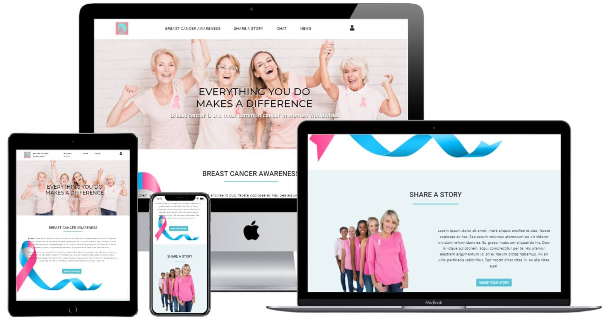
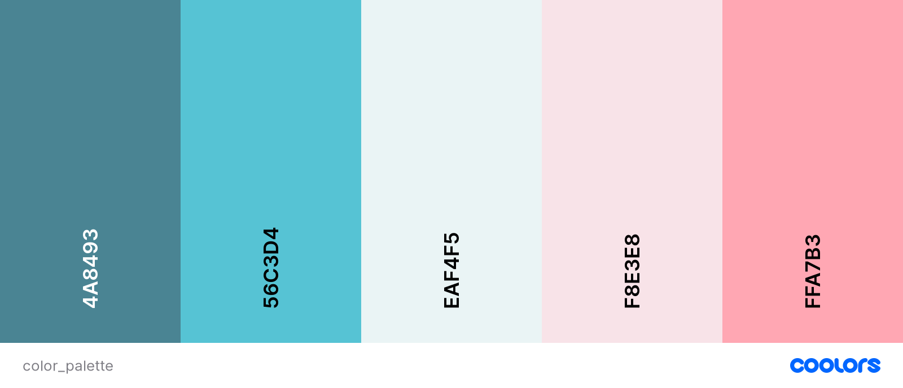

# B-Care

*Developed and designed as part of **Women in Tech Hackathon***

**[Please view the live project here](https://b-care-wit.herokuapp.com/)**

<h2 align="center"></h2>

Mockup responsive image was created with [Techsini](https://techsini.com/).

## Table of Contents

  
Click to expand table of contents

1. [Overview](#overview)
2. [User Experience UX](#user-experience-ux)
    - [Strategy](#strategy)
        - [Project Goals](#project-goals)
        - [User Stories](#user-stories)
    - [Scope](#scope)
    - [Structure](#structure)
    - [Skeleton](#skeleton)
    - [Design](#design)
        - [Color Scheme](#color-scheme)
        - [Fonts](#fonts)
        - [Imagery](#imagery)
3. [Features](#features)
    - [Existing Features](#existing-features)
    - [Future Implementation](#future-implementation)
4. [Technologies](#technologies)
5. [Testing](#testing)
6. [Version Control](#version-control)
7. [Deployment](#deployment)
8. [Credits](#credits)
9. [Acknowledgements](#acknowledgements)
10. [Disclaimer](#disclaimer)

# Overview

The project was created as part of part of **Women in Tech Hackathon** with **Code Institute**. The project is developed using Python, Flask, SocketIO, JavaScript, HTML, CSS, and Bootstrap framework.

B-Care was founded with the main purpose to reduce the stigma associated with the breast cancer for both women and men. Our main purpose is to provide a resource that will encourage people to share their stories and feelings about the disease with the ultimate aim of building communities of support.

# User Experience (UX)
## Strategy
### Project Goals

**Users**
- To navigate the website easily and understand its purpose.
- Attractive and good quality UI design.
- Get useful information about breast cancer and the prevention tips.
- To have an option to read and share personal stories.
- To read insightful articles related to the breast cancer awareness.

**Site Owner**
- To be able to approve/delete stories as an admin user.
- To have a live chat functionality.
- To be able to create admin account and approve / delete user stories.
- Provide a fully secure, easy to use and engaging website.
- Attractive and good quality UI design.

## User Stories

TBA

## Scope

The site will be fully responsive mobile first website. Many features will be available that allow the user to engage and find needed information fast and easy.

The site will consist of a homepage which gives an overview of the site's purpose, and consists of several sections - Breast Cancer Awareness, Share a Story, Live Chat, and News section respectively. 
The Second page is Breast Cancer Awareness page which gives risk, prevention and early detection tips.
Also the section with breast cancer in men was included. 

Furthermore, the website will have a Share a Story page where users can read other's stories and add their personal stories as well. Also, there will be a Chat page where a user can send a chat message to one of B-Care expert volunteers. The News page will also be included where site users can read the latest news related to the breast cancer.

## Structure

The website will be designed to be pleasing to the eye, consistent and user friendly.

- Interaction Design
    - Consistent design will be used throughout the website to maintain a good UX.
    - The navigation with effective background images will make the website look elegant and attractive.

- Information Architecture (IA)
    - The project was conceptualized as a website divided in five main pages. This structure was used because it is simple and familiar to the site visitors and it is sufficient for all user goals.
    - Short paragraphs providing the relevant information will be used. This approach was selected to provide enough information, yet not to overwhelm.
    - The content is organized and categorized by importance from top to bottom and left to right

## Skeleton
The wireframes were created in [Figma](https://www.figma.com/)

Wireframes created at the start of the project for desktop and mobile can be viewed on the below links:

Desktop Wireframes | Mobile Wireframes
------------------ | ----------------
[Homepage](readme/wireframes/desktop_home.png) | [Homepage](readme/wireframes/mobile_home.png) 
[Awareness](readme/wireframes/desktop_bca.png) | [Awareness](readme/wireframes/) 
[Stories](readme/wireframes/desktop_story.png) | [Stories](readme/wireframes/) 
[Create Story](readme/wireframes/) | [Create Story](readme/wireframes/) 
[Chat](readme/wireframes/chat.png) | [Chat](readme/wireframes/chat.png)
[News](readme/wireframes/desktop_news.png) | [News](readme/wireframes/)
[Add Article](readme/wireframes/) | [Add Article](readme/wireframes/)
[Update Article](readme/wireframes/) | [Update Article](readme/wireframes/)
[Admin Log In](readme/wireframes/)   | [Admin Log In](readme/wireframes/)

There are some modifications made in the design then planned under the initial wireframes.

## Design
### Color Scheme

Delicate and soothing color palette will be chosen and the balance with calmer, contemporary mood for the audience will be tried to get achieved. Below colors will be used for the website:

- Middle Blue (#56C3D4)

- Lavander Blush (#B3D5D2)
- Azure X 11 Web Color (#EAF4F5)
- Illuminating Emarald (#149285)
- Amaranth Pink (#FFA7B3)
- Metallic Seaweed (#4A8493)

<h2 align="center"></h2>

[Coolors](https://coolors.co/) was used to create a color palette.

Shades of blue and pink colors will be selected as the primary colors because these colors are associated with Breast Cancer Awareness month. Actually pink is primarily associated; however, our team believes that men should be equally represented.

White color will be used primarily as the background color because it represents reverence, purity, and innocence. This association calms people and influences their brain activity in a very positive way.

Metallic Seaweed (#4A8493) will be used only for footer section and it combines great with the blue and pink colors on the website.

## Fonts

- Two fonts will be used throughout the project, **Montserrat** and **Roboto**. Both will be used with ``sans-serif`` font as a fallback.

- These fonts pair very well together and make the website appear both prestigious and contemporary. This font combination looks elegant and highly readable.

- Fonts were imported from [Google Fonts](https://fonts.google.com/).

## Imagery
### Logo
[Canva](https://www.canva.com/) was used to design a custom logo and favicon.
# Features
## Existing Features
-  Navigation menu
    - responsive on all devices
    - hamburger menu on smaller devices

- Footer
    - the footer is standard across all pages on the website
    - it consist of brand's purpose, navigation links (visible only on large devices), and contact details - copyright information at the very bottom

- Responsiveness
    - by using the mobile-first approach, the website will be built to be fully responsive

- Registration option for admin user
- Manage / Approve / Delete stories for admin user
- 404 and 500 error pages
    - if a user navigates to a page which does not exist or if they do not have permission to access, they will be directed to a 404 error page
    - if there are an internal problems with the server, a 500 error page will appear

## Future Implementation
- Back to top arrow button 
- Pagination on Share a Story page
- Animate on scroll library (AOS)
- Functionality for a user to add / update / delete news articles

# User Types and permissions
There are two types of users that this website is designed for:
## Visitor

## Administrator

### Access permission

## Technologies
## Languages

- [HTML5](https://en.wikipedia.org/wiki/HTML5) was used to complete the structure of the website.
- [CSS3](https://en.wikipedia.org/wiki/CSS) was used to style the website.
- [Python](https://www.python.org/) was used was used for the backend of the website.
- [JavaScript](https://en.wikipedia.org/wiki/JavaScript) was used to make webpage interactive.

## Frameworks, Libraries and Programs

- [Bootstrap v.5.1](https://getbootstrap.com/docs/5.1/getting-started/introduction/) was used to aid in responsive, mobile-first website design. We used Bootstrap to create grid layouts, navbar, cards, forms, buttons and other features.
- [MongoDB](https://www.mongodb.com/) was used for the backend database.
- [Git](https://git-scm.com/) was used for version control.
- [GitHub](https://github.com/) was used to store the project repository and deploy the site via GitHub pages.
- [Visual Studio Code](https://code.visualstudio.com/) was used as the development environment for writing the code.
- [Jinja](https://jinja.palletsprojects.com/en/2.11.x/) was used to generate HTML from site templates.
- [PyMongo](https://pypi.org/project/pymongo/) contains tools for interacting with MongoDB database from Python.
- [Figma](https://www.figma.com/) was used to create the wireframes for the website.
- [Font Awesome](https://fontawesome.com/) was used to add several icons.
- [Google Fonts](https://fonts.google.com/) was used to import the fonts to the website.
- [Favicon](https://favicon.io/favicon-converter/) was used to create the favicon for the website.
- [CSS Tricks](https://css-tricks.com/) was used as a general source.
- [W3School](https://www.w3schools.com/) was used as a general source.
- [Stackoverflow](https://stackoverflow.com/) was used as a general source.
- [Canva](https://www.canva.com/) was used to design and create the brand logo and favicon

- [Adobe Photoshop Express](https://photoshop.adobe.com/) was used for resizing and cropping the images used on the website.
- [TinyJPG](https://tinyjpg.com/) was used for compressing images while preserving transparency.
- [Techsini](http://techsini.com/multi-mockup/index.php) was used to create the responsive mockup image.
- [Coolors](https://coolors.co/) was used for colour palette used on the website.
- [CSS Autoprefixer](https://autoprefixer.github.io/) was used for adding CSS vendor prefixes.
- [Google Chrome Developer Tools](https://developers.google.com/web/tools/chrome-devtools) was used to test and debug the code.
- [Animate On Scroll Library](https://michalsnik.github.io/aos/) was used to integrate animate on scroll effect on home page.
- [Cloudinary](https://cloudinary.com/) was used to store images and handle image uploading.

## Flask extensions
- [Flask](https://flask.palletsprojects.com/en/1.1.x/)
	- Flask micro framework was used to build the web app using python code
- [Werkzeug](https://werkzeug.palletsprojects.com/en/1.0.x/utils/#module-werkzeug.security)
	- Werkzeug Security Helpers were used to hash the user passwords before storing in the database

## Platforms
- [Heroku](https://www.heroku.com/platform) - the project uses Heroku as it's deployment platform.

## Validation
- [W3C Markup Validation Service](https://validator.w3.org/) was used for Markup validation.
- [W3C CSS Validation Service](https://jigsaw.w3.org/css-validator/) was used for CSS code validation.
- [JSHint](https://jshint.com/) was used for JavaScript code validation.
- [PEP8 Online](http://pep8online.com/) was used to check for PEP8 compliance

# Testing

## Version Control

# Deployment

## Local Installation

### Clone the GitHub Repository

### Install project dependencies

- Install project requirements by typing `pip install -r requirements.txt`

### Create a database on MongoDB

Register for a free account with [MongoDB](https://account.mongodb.com/account/register)

- Create a new Project and call it 'b-care'
- Create a Cluster, choose the free tier option and select your region
- Create a new database and call it 'bcare_db'
- Create Collections named **TBA**

Detailed db scheme is available below:

**TBA**

### Deploy locally
- To run the project locally, in the terminal type `python3 app.py`
- This will open a localhost address, which is provided in the CLI
- Either copy and paste the url into a new browser tab, or hover over it and click the link

### Deploy to Heroku

The website of this project requires back-end technologies such as server, application, and database so the website is deployed on [Heroku](https://www.heroku.com/), which is a cloud platform with a service supporting several programming languages, because GitHub can only host a static websites.

Before deploying the website to Heroku, there are three important steps to follow to make the application work in Heroku correctly.

1. Create `requirements.txt` file that contains the names of packages being used in Python. It is important to update the file if other packages or modules are installed during the project.
2. Create `Procfile` that contains the name of the application file so that Heroku knows what to run.
3. Push them into GitHub.

Once above steps have been followed the website can be deployed. Please find the steps of the deployment in Heroku:

1. Create an account in [Heroku](https://signup.heroku.com/login)
2. Click **New** & **Create new app** to create a new app
3. Put an app name, which must be unique, choose a region and click create app
4. Go to **Deploy** section and click **Connect to GithHub**
5. Search for the repository by the repository name and connect it
6. Before clicking Enable Automatic Deploys, hidden variables such as IP address, PORT, SECRET_KEY, MONGO_URI and MONGO_DATABASE need to be recorded in Heroku. Go to **Settings**, click **Reveal Config Vars** and fill out necessary keys and values.
7. Once all the hidden variables are recorded, then click **Enable Automatic Deploys** and click **Deploy Branch** (Main should be selected unless you want other branches to be deployed).
8. When the app is deployed by Heroku correctly, there is a confirmation message and you can access the app.

**Note** 
*It is important NOT to set `debug=True` when deploying the website.*

# Credits

## Code

## Media
### Images

#### Home page images
- Hero image from [Shutterstock](https://www.shutterstock.com/image-photo/group-smiling-ladies-pink-ribbons-cheering-680520391)
- White Banner with PRO-LIFE Awareness Realistic Ribbon from [Shutterstock](https://www.shutterstock.com/image-vector/white-banner-prolife-awareness-realistic-ribbon-1091915720)
- Group of women wearing pink tops and ribbons for breast cancer on white background from [Shutterstock](https://www.shutterstock.com/image-photo/group-women-wearing-pink-tops-ribbons-145467715)
 - Photo by Ono Kosuki from [Pexels](https://www.pexels.com/photo/positive-black-woman-reading-text-message-on-smartphone-6000094/)

#### Awareness page images
- Hero image from [Shutterstock](https://www.shutterstock.com/image-photo/female-doctor-pink-ribbon-cancer-concept-436570036)

#### News page images
- Hero image from [Shutterstock](https://www.shutterstock.com/image-photo/focused-worried-couple-paying-bills-online-1038126691)
### Icons
- Icons were sourced from [Font Awesome](https://fontawesome.com/)

## Content

The website texts were adapted from: 
[Centers For Disease Control and Prevention](https://www.cdc.gov/cancer/breast/basic_info/prevention.htm) 
[Breast Cancer Ireland](https://www.breastcancerireland.com/)
# Acknowledgements

# Disclaimer
The information provided on this website is for educational purposes only.

> [Back to Top](#table-of-contents) 
